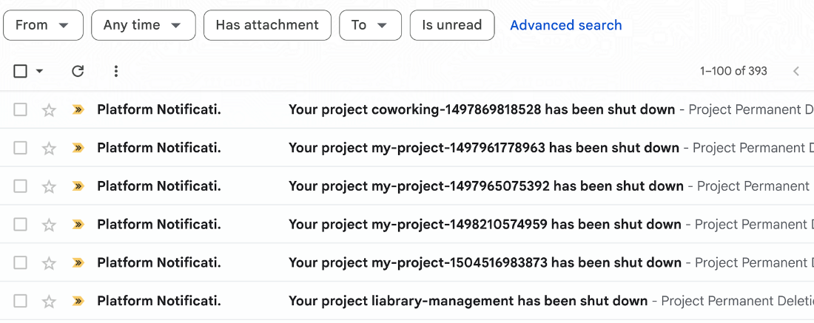

# GCP Project Cleanup Tool

Automated tool to identify and batch delete obsolete Google Cloud Platform (GCP) projects at scale. A lightweight, zero-dependency Python script for FinOps teams, DevOps engineers, and SREs to eliminate cloud waste and reduce cloud sprawl.

    

## Why This Exists

Managing hundreds of GCP projects leads to accumulation of abandoned and unattended projects that:

- Incur unnecessary costs from idle resources and unused infrastructure
- Create security risk from unmonitored resources and orphaned service accounts
- Contribute to cloud sprawl, making project governance difficult
- Clutter the project list, making it hard to find active projects

This tool automates the discovery of obsolete projects organization-wide, identifies unused resources based on activity timestamps, and provides a safe workflow to batch delete them—helping FinOps teams reduce cloud waste and optimize costs.

## Background

This tool was built to solve a real problem: managing 420+ GCP projects at [Concret.io](https://concret.io), where manual cleanup was impractical and existing solutions required too much infrastructure overhead.

### The Problem at Scale

Sequential scanning of 427 projects took **7+ hours**, each project requiring multiple API calls to check Compute Engine, Cloud Storage, Cloud SQL, App Engine, and other services individually. With projects accumulating faster than they could be reviewed, cloud waste grew unchecked.

### Engineering Decisions

**1. Cloud Asset Inventory API (10-20x faster)**

Instead of querying each GCP service individually (4-8 API calls per project), we use the Cloud Asset Inventory API to retrieve all resources in a single call:

```bash
gcloud asset search-all-resources --scope=projects/my-project-id --format=json
```

The response is a JSON array containing every resource in the project, regardless of service type:

```json
[
  {
    "name": "//compute.googleapis.com/projects/my-project/zones/us-central1-a/instances/web-server",
    "assetType": "compute.googleapis.com/Instance",
    "updateTime": "2025-03-15T10:30:00Z",
    "createTime": "2024-01-10T08:00:00Z"
  },
  {
    "name": "//storage.googleapis.com/projects/_/buckets/my-backup-bucket",
    "assetType": "storage.googleapis.com/Bucket",
    "updateTime": "2024-06-01T14:00:00Z",
    "createTime": "2023-02-20T09:00:00Z"
  },
  {
    "name": "//sqladmin.googleapis.com/projects/my-project/instances/prod-db",
    "assetType": "sqladmin.googleapis.com/Instance",
    "updateTime": "2025-01-10T08:45:00Z",
    "createTime": "2022-11-15T16:30:00Z"
  }
]
```

Resources are categorized by their `assetType`:

- **Compute** → `compute.googleapis.com/Instance`, `/Disk`, `/Snapshot`, `/Image`
- **Storage** → `storage.googleapis.com/Bucket`
- **Databases** → `sqladmin.googleapis.com/Instance`
- **Serverless** → `appengine.googleapis.com/Application`, `cloudfunctions.googleapis.com/CloudFunction`
- **Other** → Everything else the API returns

This alone reduced per-project scan time from ~60 seconds to ~3-5 seconds.

**2. Multi-threaded Parallel Processing**

Using Python's `ThreadPoolExecutor` with configurable workers (default: 10), we analyze multiple projects concurrently:

```python
with ThreadPoolExecutor(max_workers=self.workers) as executor:
    future_to_project = {
        executor.submit(self._analyze_project_worker, project, i): project
        for i, project in enumerate(projects)
    }
    for future in as_completed(future_to_project):  # Process fastest first
        result = future.result()
```

Three thread-safe locks coordinate concurrent operations:

- `_log_lock`: Prevents garbled console output
- `_progress_lock`: Synchronizes completion counter
- `_save_lock`: Coordinates file writes

**3. Incremental Persistence (Crash Recovery)**

Both output files are written after every single project analysis—not batched. This enables:

- **Resume on interrupt**: Re-run picks up where it left off
- **Real-time progress**: Files always reflect current state
- **Zero progress loss**: Ctrl+C mid-scan loses only the current project

```python
def _save_files(self, in_progress: bool = True):
    with self._save_lock:  # Thread-safe write
        # Categorize and save both files
        with open(self.REPORT_FILE, 'w') as f:
            json.dump(report, f, indent=2, default=str)
```

**4. Memory-Efficient Storage**

Instead of storing full resource objects, we store only counts:

```python
# Compact format: ~95% size reduction
{"instances": 5, "disks": 2, "buckets": 1}

# vs. Full format (avoided)
{"instances": [{...full resource...}, {...}, ...]}
```

This keeps memory footprint low even when scanning hundreds of projects.

### Performance Results


| Metric                    | Before   | After    |
| ------------------------- | -------- | -------- |
| Scan time (420+ projects) | 7+ hours | < 1 hour |
| API calls per project     | 4-8      | 1        |
| Memory per project        | ~50KB    | ~2KB     |
| Resume capability         | None     | Full     |


### Battle-Tested

This tool has been validated on production infrastructure:

- **Scale**: 427 GCP projects scanned
- **Environment**: Production GCP organization with 10+ years of cloud sprawl
- **Results**: 393 zombie projects deleted, 24 flagged for review
- **Impact**: 34% reduction in monthly GCP spend

Here is how your Gmail Inbox might look like after you will run the [deletion script:](./delete_projects.py)



📖 **Full story**: [Why I Built My Own GCP Cleanup Tool Instead of Using Google's](https://medium.com/@abhinavguptas/why-i-built-my-own-gcp-cleanup-tool-instead-of-using-googles-a788d9969c59)

The multi-threaded chunked-write architecture was critical—early versions without incremental persistence would lose hours of progress on network timeouts or API rate limits.

## How It Compares


| Feature                      | This Tool                  | [Remora](https://cloud.google.com/blog/topics/developers-practitioners/automated-cleanup-unused-google-cloud-projects/) | [SafeScrub](https://github.com/doitintl/SafeScrub) | [ZUNA](https://www.c2cglobal.com/articles/how-to-auto-clean-your-gcp-resources-738) |
| ---------------------------- | -------------------------- | ----------------------------------------------------------------------------------------------------------------------- | -------------------------------------------------- | ----------------------------------------------------------------------------------- |
| **Scope**                    | Multi-project              | Multi-project                                                                                                           | Single project                                     | Single project                                                                      |
| **Detection method**         | Cloud Asset Inventory API  | Recommender API                                                                                                         | Manual                                             | Label-based                                                                         |
| **Parallel processing**      | Yes (configurable workers) | N/A                                                                                                                     | No                                                 | No                                                                                  |
| **Auto-resume on interrupt** | Yes                        | No                                                                                                                      | No                                                 | No                                                                                  |
| **Infrastructure required**  | None (CLI only)            | Terraform, Cloud Workflows, BigQuery, Pub/Sub                                                                           | None                                               | Cloud Functions, Scheduler                                                          |
| **Activity-based detection** | Yes (resource timestamps)  | Recommender-based (30+ days low usage)                                                                                  | No                                                 | No                                                                                  |
| **Two-tier classification**  | Yes (safe/review)          | No                                                                                                                      | No                                                 | No                                                                                  |
| **Dependencies**             | Python stdlib only         | Multiple GCP services                                                                                                   | Go binary                                          | Python + GCP services                                                               |


**When to use this tool:**

- You manage 50+ GCP projects and need periodic cleanup automation
- You want a lightweight CLI solution without deploying Terraform, Cloud Functions, or other infrastructure
- You need an alternative to Google's Unattended Project Recommender that works without BigQuery or Pub/Sub
- You need resumable scans (interrupt and continue later)
- You want fast scanning via Cloud Asset Inventory API (10-20x faster than individual service checks)

## Key Decisions

### Cloud Asset Inventory API (Primary)

Uses GCP's Cloud Asset Inventory API to scan all resources in a single API call per project, rather than querying each service individually. This is 10-20x faster than checking Compute, Storage, SQL, etc. separately.

### Parallel Processing

Analyzes multiple projects concurrently (default: 10 workers). With 427 projects, sequential processing took 7+ hours; parallel processing reduces this to under 1 hour.

> [!NOTE]
> **Rate Limits:** The Cloud Asset Inventory API has a default quota of 100 requests per 100 seconds per project. With the default 10 workers, you're unlikely to hit this limit. If scanning 500+ projects or using 20+ workers, you may encounter `429 RESOURCE_EXHAUSTED` errors—the script will skip affected projects (use `--no-skip-timeout` to fail instead). To avoid rate limits entirely, use `--workers 5` or `--sequential` mode. See [Cloud Asset API quotas](https://cloud.google.com/asset-inventory/docs/quota) for details.

### Incremental Progress & Auto-Resume

Both output files are updated after every project. If interrupted, just re-run - the script automatically resumes from where it left off. Use `--fresh` to start over.

### Two-Tier Classification

For each project, the script finds the most recent `updateTime` across all resources. That becomes the project's "last activity" date:

- **safe_to_delete**: No resources OR no activity for 180+ days
- **review_required**: Low activity (90-180 days) - flagged for manual review

```python
# The core classification logic
def classify_project(project, last_activity_days):
    if last_activity_days > 180:
        return "safe_to_delete"
    elif last_activity_days > 90:
        return "review_required"
    return "keep"
```

Additional obsolescence triggers:

- **No resources at all** → Obsolete (empty project)
- **Project state not ACTIVE** → Obsolete (already marked for deletion)

### Dry-Run by Default

Deletion script defaults to dry-run mode and requires explicit confirmation (typing "DELETE") before any actual deletion.

## Quick Start

```bash
# 1. Authenticate
gcloud auth login

# 2. Enable Asset Inventory API (required, one-time, on any project)
gcloud services enable cloudasset.googleapis.com --project=YOUR_PROJECT_ID

# 3. Find obsolete projects
python3 find_obsolete_projects.py

# 4. Review the output
cat projects_for_deletion.json

# 5. Delete (dry-run first)
python3 delete_projects.py

# 6. Actually delete (requires confirmation)
python3 delete_projects.py --execute
```

## Usage

### Finding Obsolete Projects

```bash
# Default: 10 parallel workers
python3 find_obsolete_projects.py

# Faster: 20 parallel workers
python3 find_obsolete_projects.py --workers 20

# Test with limited projects first
python3 find_obsolete_projects.py --limit 10

# Sequential mode (slower, for debugging)
python3 find_obsolete_projects.py --sequential
```

### Resume by Default

The script automatically resumes from previous progress. If interrupted, just re-run:

```bash
# Resumes automatically (skips already-analyzed projects)
python3 find_obsolete_projects.py

# Start completely fresh (clears progress and re-analyzes everything)
python3 find_obsolete_projects.py --fresh
```

**Output files (both updated after every project):**

- `obsolete_projects_report.json` - Full categorized report (also used for resume)
- `projects_for_deletion.json` - Deletion-ready file with safe_to_delete and review_required lists

## Output File Formats

### `obsolete_projects_report.json`

Full analysis report with projects categorized into three groups:

```json
{
  "metadata": {
    "generated_at": "2026-01-14T15:46:20.786101",
    "total_analyzed": 422,
    "in_progress": false
  },
  "summary": {
    "obsolete": 397,
    "potentially_obsolete": 20,
    "active": 5
  },
  "obsolete": [
    {
      "project_id": "my-old-project",
      "project_name": "My Old Project",
      "project_number": "123456789012",
      "lifecycle_state": "ACTIVE",
      "total_resources": 0,
      "resource_counts": {
        "instances": 0, "disks": 0, "snapshots": 0, "images": 0,
        "buckets": 0, "sql_instances": 0, "app_engines": 0,
        "cloud_functions": 0, "other": 0
      },
      "last_activity": null,
      "days_since_activity": null,
      "is_obsolete": true,
      "obsolete_reasons": ["No resources found"]
    }
  ],
  "potentially_obsolete": [],
  "active": []
}
```

### `projects_for_deletion.json`

Deletion-ready format consumed by `delete_projects.py`:

```json
{
  "metadata": {
    "generated_at": "2026-01-14T15:46:20.792383",
    "generated_by": "find_obsolete_projects.py",
    "version": "1.0",
    "in_progress": false
  },
  "summary": {
    "total_safe_to_delete": 397,
    "total_need_review": 20,
    "total_candidates": 417
  },
  "projects_to_delete": [
    {
      "project_id": "inactive-project-123",
      "project_name": "Inactive Project",
      "project_number": "987654321098",
      "lifecycle_state": "ACTIVE",
      "total_resources": 5,
      "last_activity": "2025-07-06T04:35:08",
      "days_since_activity": 192,
      "obsolete_reasons": ["No activity for 192 days"],
      "deletion_status": "safe_to_delete",
      "resource_counts": {}
    }
  ],
  "projects_to_review": [
    {
      "project_id": "low-activity-project",
      "project_name": "Low Activity Project",
      "lifecycle_state": "ACTIVE",
      "total_resources": 6,
      "last_activity": "2025-09-15T10:06:29",
      "days_since_activity": 121,
      "obsolete_reasons": ["Low activity (last used 121 days ago)"],
      "deletion_status": "review_required",
      "resource_counts": {}
    }
  ]
}
```

### After Deletion

When projects are deleted, they're updated in-place with status and timestamp:

```json
{
  "project_id": "deleted-project",
  "deletion_status": "deleted",
  "deleted_at": "2026-01-16T14:30:00"
}
```

### Deleting Projects

```bash
# Dry run (safe, shows what would be deleted)
python3 delete_projects.py

# Actually delete (requires typing 'DELETE' to confirm)
python3 delete_projects.py --execute

# Include projects marked for review
python3 delete_projects.py --execute --include-review

# Use a different input file
python3 delete_projects.py --file my_projects.json --execute
```

**Re-run safety:** After successful deletion, projects are marked with `deletion_status: "deleted"` and `deleted_at` timestamp in the JSON file. Re-running the delete script will skip already-deleted projects.

## Requirements

- Python 3.8+ (standard library only—**zero external dependencies**, no `pip install` needed)
- [Google Cloud CLI](https://cloud.google.com/sdk/docs/install) (`gcloud`) installed and authenticated

**No service account keys or credential files required.** This tool uses your authenticated `gcloud` CLI session. Just run `gcloud auth login` with a GCP account that has the necessary permissions.

### Setup

```bash
# 1. Install Google Cloud CLI (if not already installed)
# See: https://cloud.google.com/sdk/docs/install

# 2. Authenticate with your GCP account
gcloud auth login

# 3. Enable Cloud Asset Inventory API (one-time, on any project you have access to)
gcloud services enable cloudasset.googleapis.com --project=YOUR_PROJECT_ID
```

### Required Permissions

The tool uses the following `gcloud` commands, each requiring specific IAM permissions:


| Operation           | gcloud Command                      | Required Permission                    | Predefined Roles                                                                                                                                        |
| ------------------- | ----------------------------------- | -------------------------------------- | ------------------------------------------------------------------------------------------------------------------------------------------------------- |
| List projects       | `gcloud projects list`              | `resourcemanager.projects.list`        | [Browser](https://cloud.google.com/iam/docs/understanding-roles#browser) (`roles/browser`), Owner                                                       |
| Get project details | `gcloud projects describe`          | `resourcemanager.projects.get`         | [Browser](https://cloud.google.com/iam/docs/understanding-roles#browser) (`roles/browser`), Owner                                                       |
| Scan resources      | `gcloud asset search-all-resources` | `cloudasset.assets.searchAllResources` | [Cloud Asset Viewer](https://cloud.google.com/asset-inventory/docs/access-control) (`roles/cloudasset.viewer`), Owner                                   |
| Delete project      | `gcloud projects delete`            | `resourcemanager.projects.delete`      | [Project Deleter](https://cloud.google.com/iam/docs/understanding-roles#resourcemanager.projectDeleter) (`roles/resourcemanager.projectDeleter`), Owner |


> **Note:** The basic `roles/viewer` role does **not** include `cloudasset.assets.searchAllResources`. You need either `roles/cloudasset.viewer` or `roles/owner`.

#### Recommended Role Combinations

**For scanning only (read-only):**

- `roles/browser` + `roles/cloudasset.viewer` at organization/folder level
- Or simply `roles/owner` on the projects

**For scanning + deletion:**

- `roles/owner` on the projects you want to scan and delete
- Or a custom role combining the permissions above

## Files


| File                        | Purpose                                       |
| --------------------------- | --------------------------------------------- |
| `find_obsolete_projects.py` | Scans projects and identifies obsolete ones   |
| `delete_projects.py`        | Deletes projects from the generated JSON file |


## Obsolescence Criteria

A project is marked **obsolete** if:

- No resources found (empty project)
- No activity for 180+ days
- Project lifecycle state is not ACTIVE (e.g., DELETE_REQUESTED)

A project is marked **review_required** if:

- Low activity (90-180 days since last resource update)

Activity is determined by the most recent `updateTime` or `createTime` across all resources returned by the Asset Inventory API.

## Troubleshooting

### Common Errors

`**PERMISSION_DENIED: The caller does not have permission**`

```
You need `roles/cloudasset.viewer` at the organization or folder level.
The basic `roles/viewer` role does NOT include Cloud Asset Inventory permissions.
```

`**429 RESOURCE_EXHAUSTED: Quota exceeded**`

```bash
# Reduce parallel workers
python3 find_obsolete_projects.py --workers 5

# Or use sequential mode
python3 find_obsolete_projects.py --sequential
```

`**Cloud Asset Inventory API has not been enabled**`

```bash
# Enable the API (one-time, on any project you have access to)
gcloud services enable cloudasset.googleapis.com --project=YOUR_PROJECT_ID
```

**Script seems stuck / no progress**

```bash
# Check if incremental progress is being saved
ls -la obsolete_projects_report.json

# The script saves after every project - if file is updating, it's working
watch -n 5 'wc -l obsolete_projects_report.json'
```

**Want to start fresh after a failed run**

```bash
python3 find_obsolete_projects.py --fresh
```

## Use Cases

- **FinOps cost optimization**: Identify and eliminate cloud waste from abandoned projects
- **Security hygiene**: Remove unattended projects with stale credentials or open firewall rules
- **Project governance**: Enforce cleanup policies across your GCP organization
- **Pre-audit cleanup**: Prepare for compliance audits by removing orphaned resources
- **Development environment cleanup**: Batch delete old dev/test/sandbox projects

## Keywords

`gcp-cleanup` `google-cloud` `finops` `cloud-waste` `cost-optimization` `devops` `sre` `automation` `cloud-governance` `project-management` `gcloud` `python`

## Contributing

Contributions are welcome! Please feel free to submit a Pull Request.

## License

This project is licensed under the Apache License 2.0 - see the [LICENSE](LICENSE) file for details.